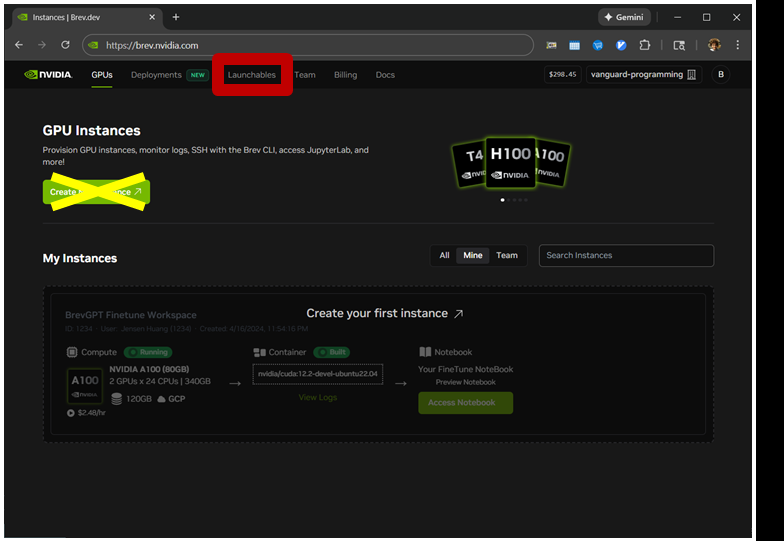
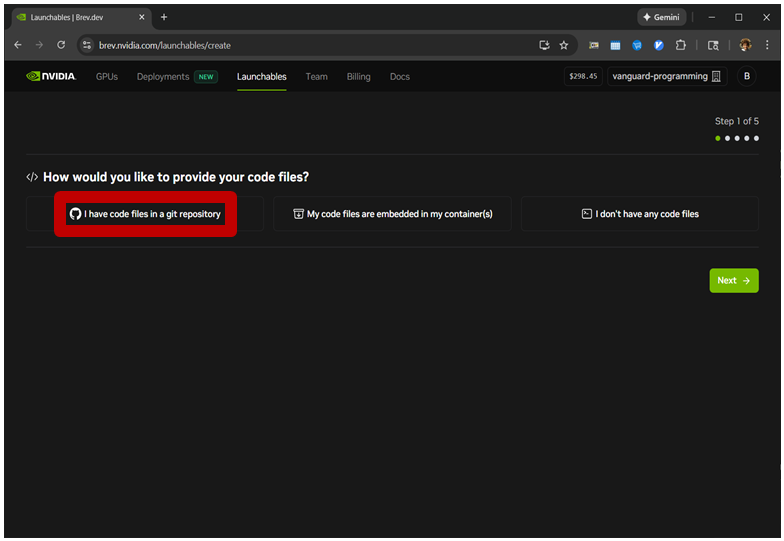
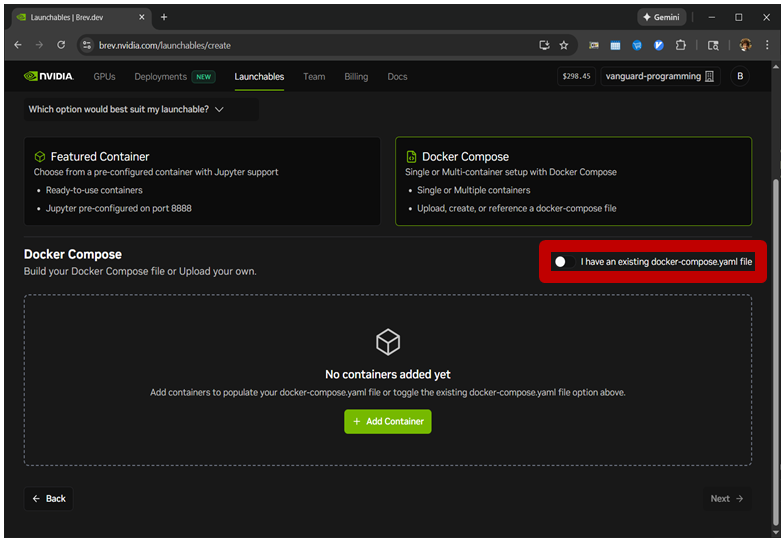
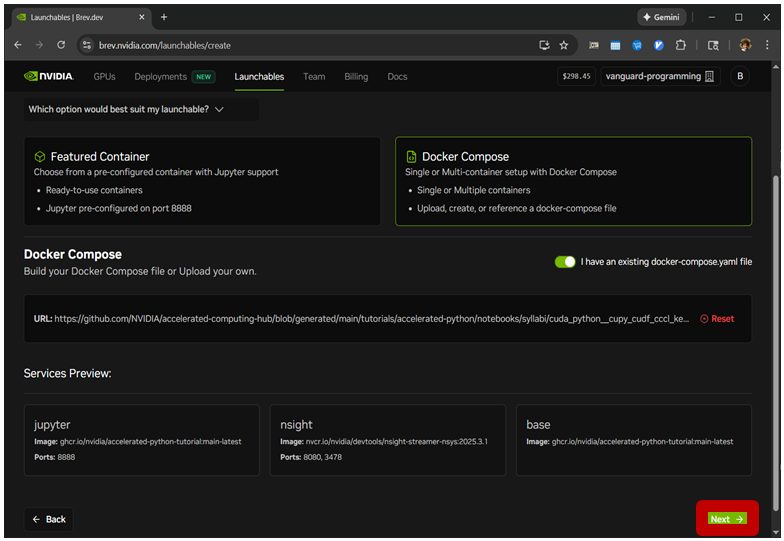
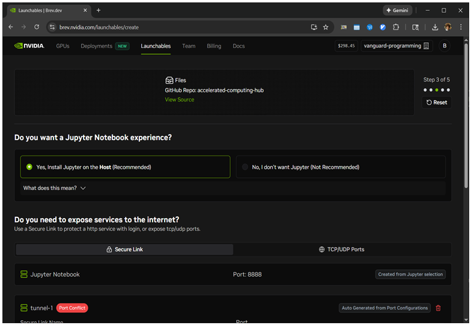
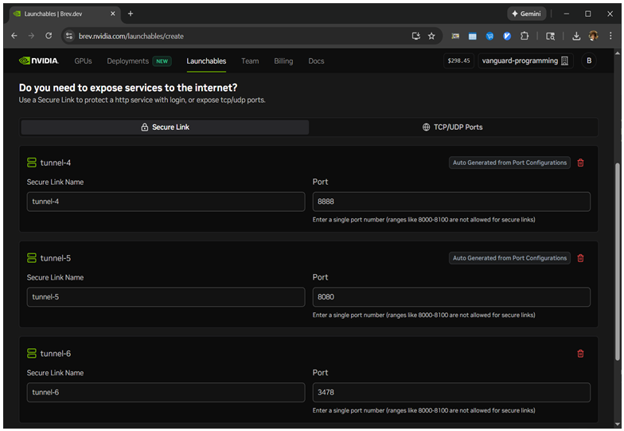
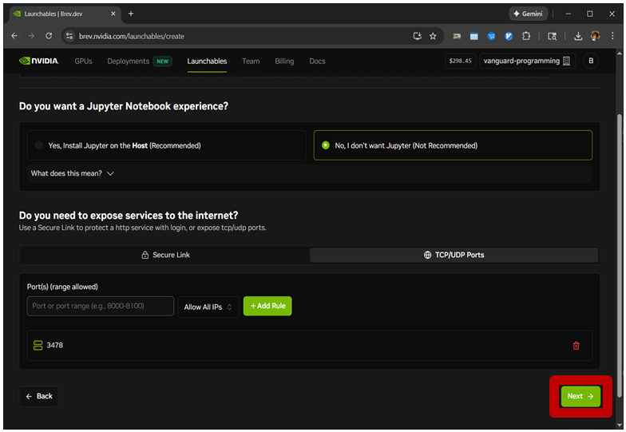
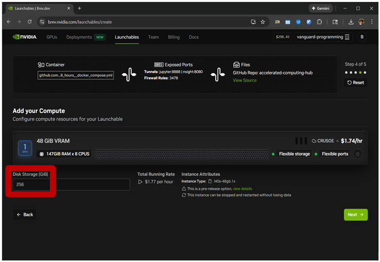

# How to Create a Brev Launchable from Accelerated Computing Hub Content

## Instructions

- Get the GitHub web URL to the Docker Compose file for the Accelerated Computing Hub content from [the README](../README.md).
- Go to [brev.nvidia.com](https://brev.nvidia.com).
- Login and select correct organization.
- Click "Launchables".

### Code Page

- Click "I have code files in a git repository".
- Select "Enter a public repository, notebook file, or markdown file URL" textbox and input "https://github.com/NVIDIA/accelerated-computing-hub".
- Click "With container(s)".
- Click "Next".

### Container Page

- Click "Docker Compose".
- Click "I Have an existing docker-compose.yaml file".
- Click "Provide GitHub/Gitlab URL".
- Select "GitHub/GitLab URL" textbox and input the content's Docker Compose file.
- Click "Validate".
- Click "Next".

### Services Page

- Click "No, I don't want Jupyter".
- Scroll to "Secure Links".
- Rename "tunnel-4" to "jupyter" on port 8888.
- Rename "tunnel-5" to "jupyter" on port 8080.
- Delete "tunnel-6".
- Click "TCP/UDP Ports".
- Select "Port or port range" textbox and input "3478".
- Click "Add Rule".
- Click "Next".

### Compute Page

- Select an instance type and provider that meets the requirements for the content from [the README](../README.md)
- Select "Data Storage" textbox and enter amount.
- Click "Next".

### Review Page

- Select "Enter a name for your Launchable" textbox and input the content's name.
- Click "Create Launchable".
- Click "View Deploy Page".

## Screenshots

### Code Page

### Container Page

### Services Page

### Compute Page

### Review Page

