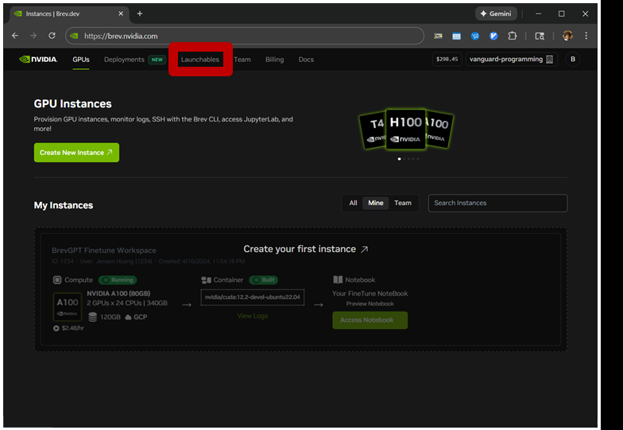
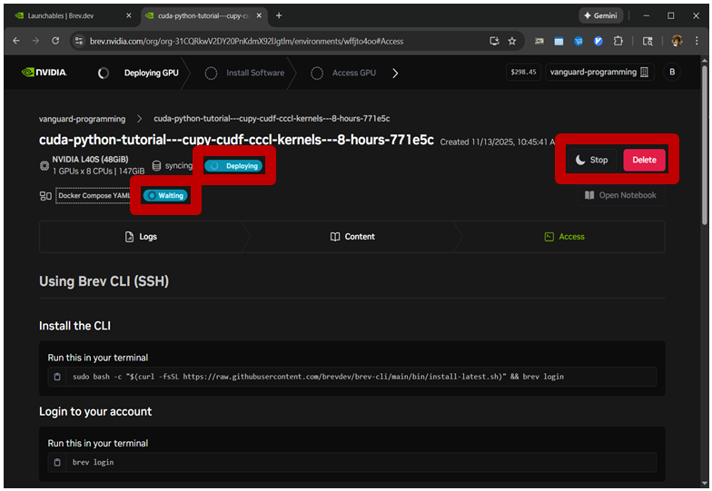
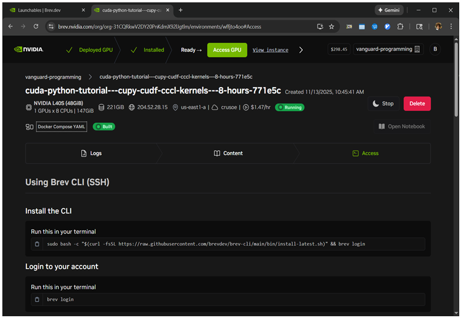

# Deploy an Accelerated Computing Hub Brev Launchable

## Instructions

- If you have a Brev team invite URL from an instructor:
  - Go to the invite URL.
  - [Login or signup to Brev](brev_login_signup.md) and select the correct organization.
  - Click "Launchables" on the navigation bar at the top.
  - Click "My Launchables" instead of "Explore" in the middle.
  - Click "View Launchable" on the Launchable specified by the instructor.
- If you have a Brev Launchable URL, go to it.
- Click "Deploy Launchable".
- Click "Go to Instance Page".
- You will see two blue status indicators, one that says "Deploying" and one that says "Waiting".
- Wait for the blue "Deploying" indicator to change to a green "Running" annd the blue "Waiting" indicator to change to a blue "Deploying" indicator. This typically takes 1 to 3 minutes.
- Wait for the blue "Deploying" indicator to change to a green "Built" indicator. This typically takes 4 to 10 minutes.
- Click "Open Notebook" once it starts flashing green. If it does not start flashing green within 60 seconds of both indicators turning green, refresh the page.
- You are now in the JupyterLab environment.
- You will either have a syllabus notebook open with instructions, or you can explore the available notebooks in the file browser on the left.

## Screenshots

