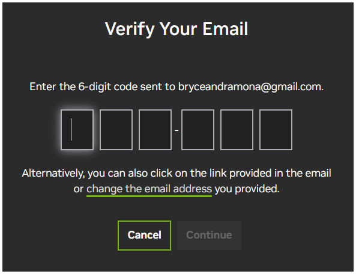
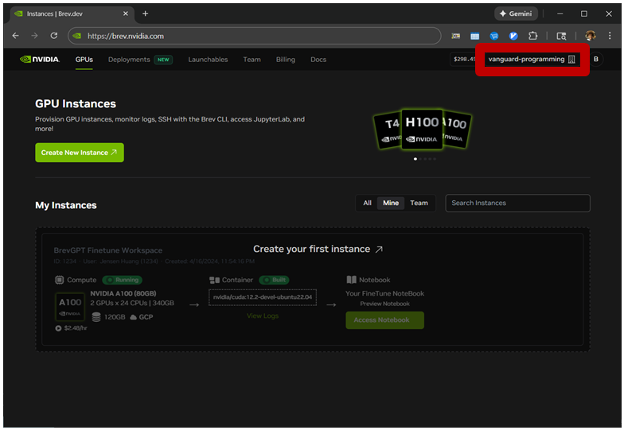
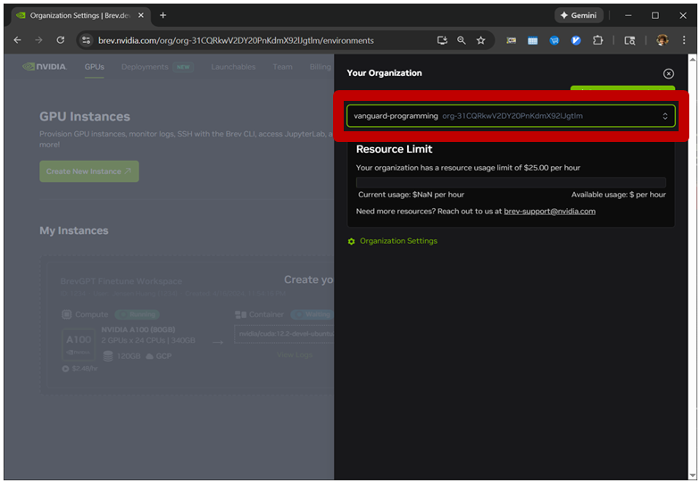

# How to Login or Signup to Brev

## Instructions

- Go to [brev.nvidia.com](https://brev.nvidia.com), a Brev Launchable URL, or a Brev team invite URL from your instructor.
- Enter your email address and click "Continue".
- If you already have an account, you'll be prompted for your password and then you'll be logged in.
- If you don't have an account, you'll be asked to enter a password or select a federated sign in option like Google, Discord, Apple, or Facebook.
- You will then be asked for a 6 digit confirmation code that is sent to your email.
- Next you will be asked if you want to receive emails. Click "Submit" to proceed.
- Then you will be asked to "Create an NVIDIA Cloud Account". Select the "Account Name" textbox and enter your first name and last name. Click "Create NVIDIA Cloud Account" to proceed.
- If you are taking an instructor led course and have previously used the Brev platform, it is possible that you have the wrong team selected. Click the team name on the top right to change your team.

## Screenshots

